# AWS Serverless Developer

Repositório de preparação para a certificação AWS Developer.

## Conceitos

### AWS
- Computação sem servidor
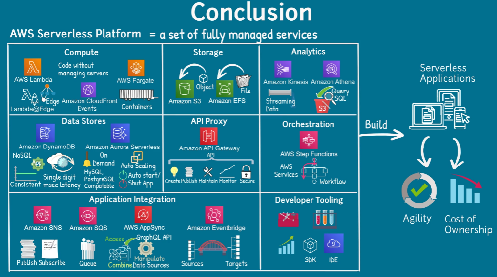
- Microsserviços
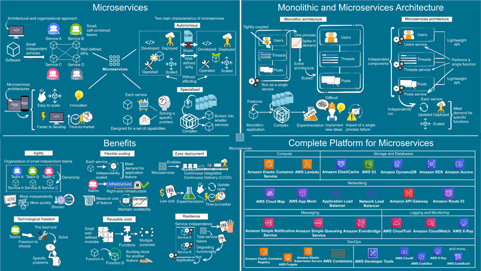

### AWS Lambda
- Visão geral do AWS Lambda
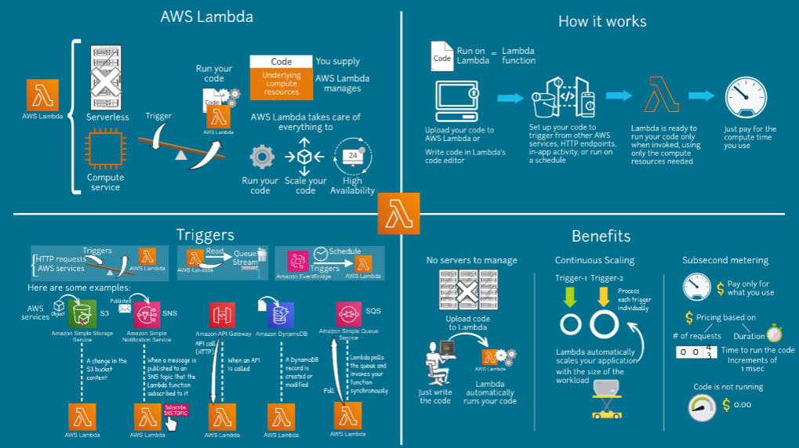
- Invocação do AWS Lambda
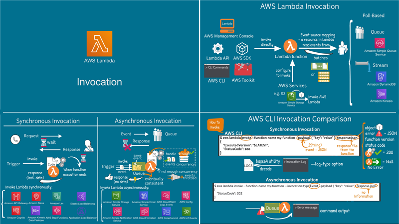
- Simultaneidade no AWS Lambda
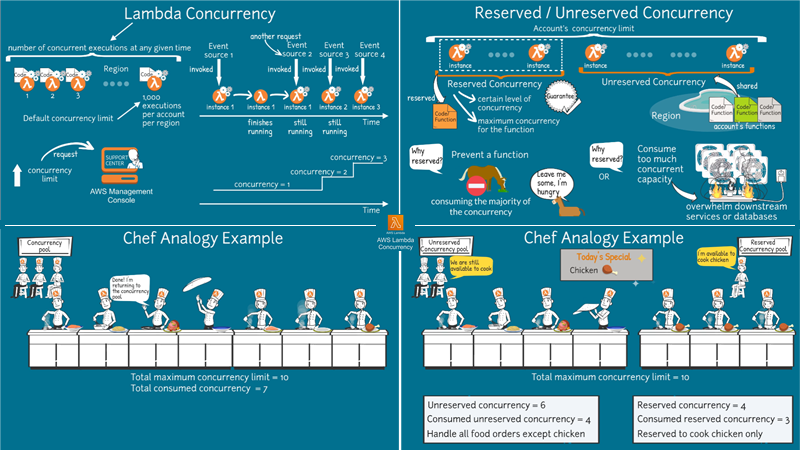
- Processamento de erros no AWS Lambda
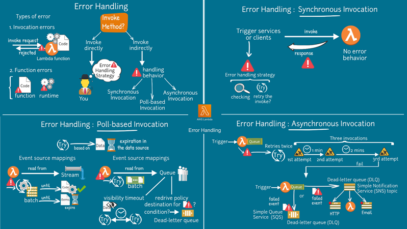

### Amazon API Gateway
- Visão geral do Amazon API Gateway
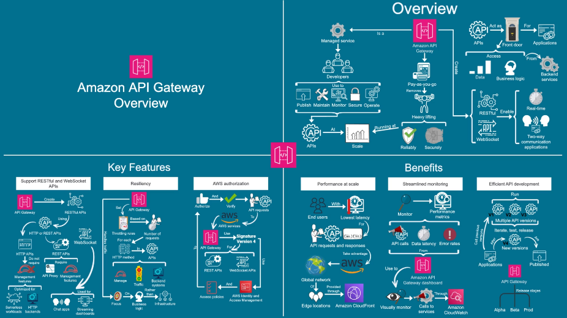
- Estágios do Amazon API Gateway
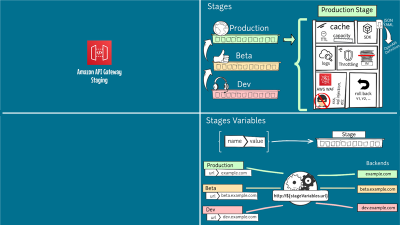
- Visão geral de estratégias de versionamento no Amazon API Gateway

### Amazon CloudWatch
- Visão geral do Amazon CloudWatch

### Amazon DynamoDB
- Visão geral do Amazon DynamoDB
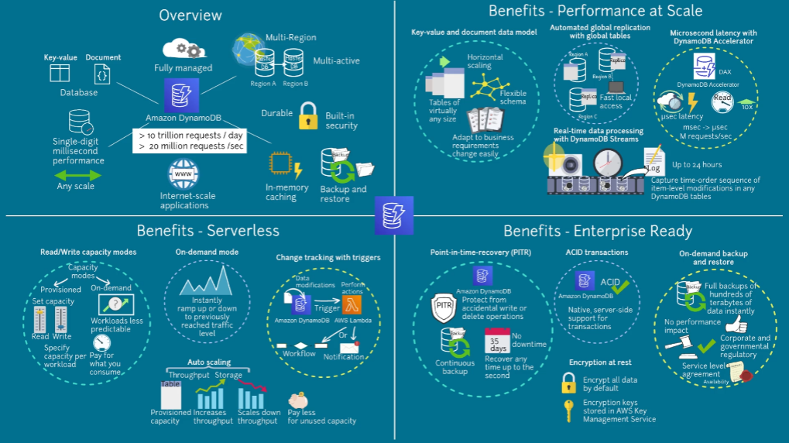
- Diferença entre SQL e NoSQL
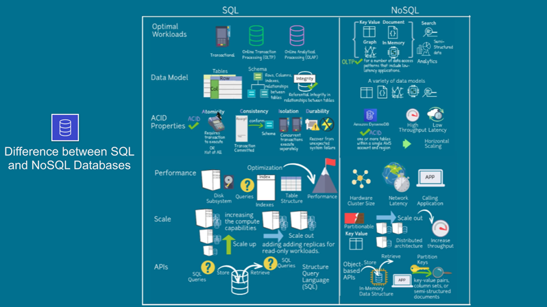
- Como criar uma tabela NoSQL
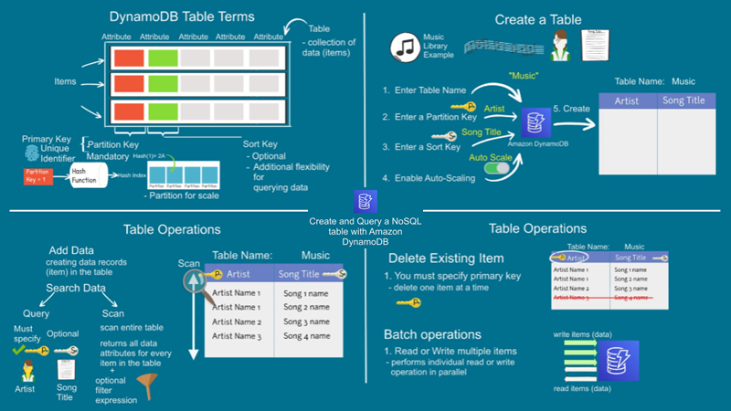
- NoSQL
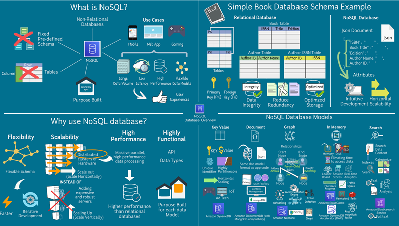
- Visão geral de scan do Amazon DynamoDB
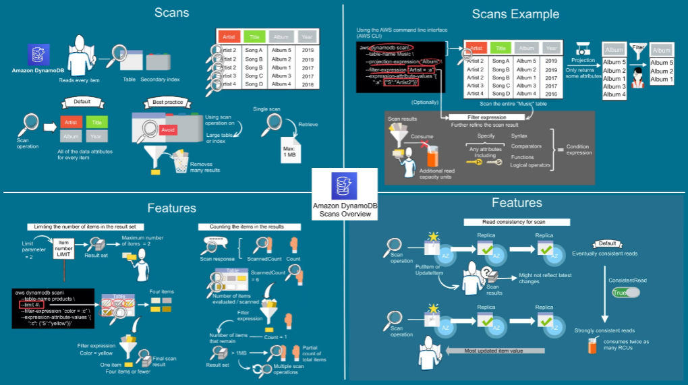
- Visão geral de consultas do Amazon DynamoDB
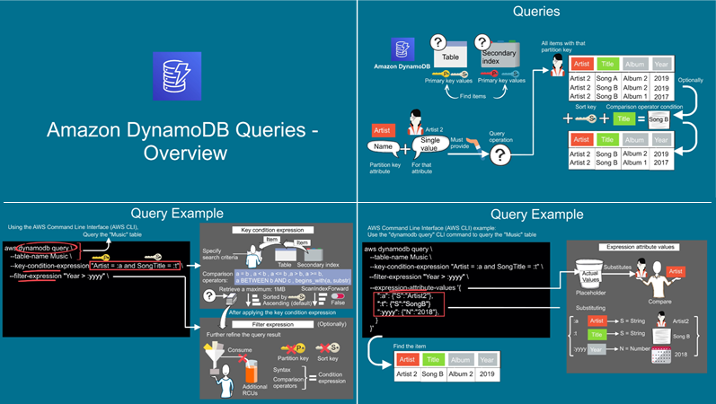
- Recursos de scan do Amazon DynamoDB
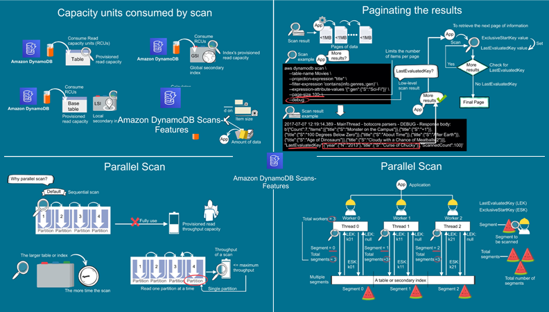
- Recursos de consultas do Amazon DynamoDB
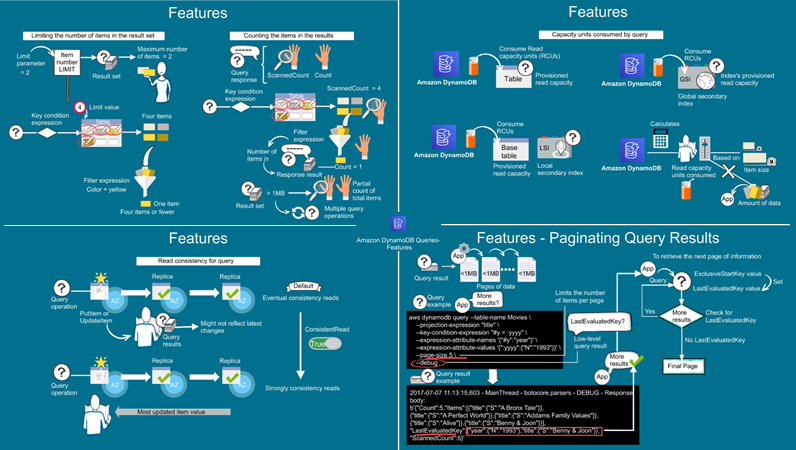