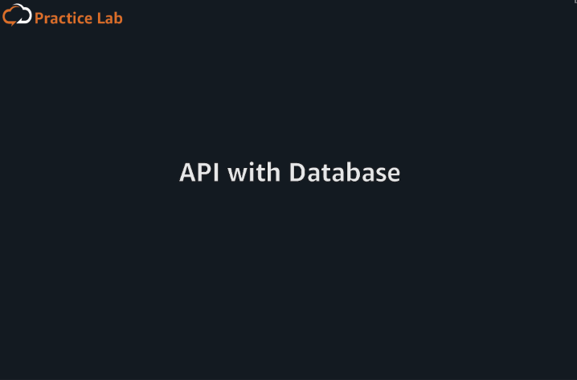
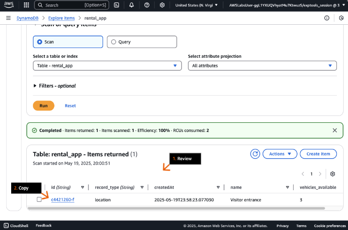
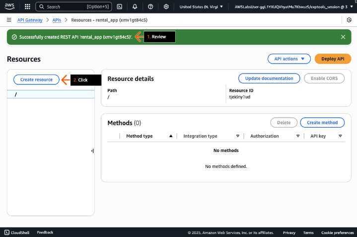
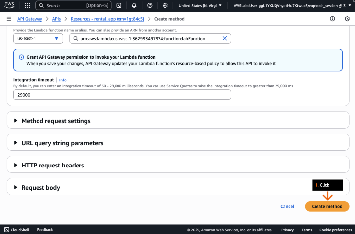

## API with Database
### Adicione um banco de dados NoSQL ao aplicativo de aluguel de veículos e integre o aplicativo com Amazon API Gateway e AWS Lambda.

- Objetivos do laboratório
    - Criar uma tabela do Amazon DynamoDB.
    - Definir o esquema da tabela.
    - Criar uma função AWS Lambda para criar, atualizar e consultar itens da tabela.
    - Expor uma API RESTful do Amazon API Gateway para a função Lambda.

    &nbsp;

    **Etapa 1**
    1. Revise os objetivos do laboratório prático na seção Conceito.
    2. Clique em Iniciar Laboratório ou Abrir Console AWS para começar.
    3. Siga as instruções do laboratório atentamente e use as setas para navegar entre as etapas.

    Os serviços da AWS não utilizados neste laboratório estão desabilitados no ambiente do laboratório. Além disso, os recursos dos serviços utilizados neste laboratório são limitados ao que o laboratório exige.

    **Conceito**

    Neste laboratório prático, você irá:
    - Criar uma tabela do Amazon DynamoDB.
    - Definir o esquema da tabela.
    - Criar uma função AWS Lambda para criar, atualizar e consultar itens da tabela.
    - Expor uma API RESTful do Amazon API Gateway para a função Lambda.

    

    &nbsp;

    **Etapa 2**
    1. Na caixa de pesquisa da barra de navegação superior, digite: dynamo
    2. Nos resultados da pesquisa, em Services, clique em DynamoDB.
    3. Vá para a próxima etapa.

    **Conceito**

    Amazon DynamoDB ajuda a descarregar os encargos administrativos de operar e escalar um banco de dados distribuído para que você não precise se preocupar com provisionamento de hardware, configuração e setup, replicação, aplicação de patches de software ou escalonamento de cluster.

    

    &nbsp;

    **Etapa 3**
    1. No painel de navegação esquerdo, clique em Tables.
    2. Na seção Tables, clique em Create table.
    3. Vá para a próxima etapa.

    **Conceito**

    Tabelas, itens e atributos são os componentes centrais com os quais você trabalha no DynamoDB. Uma tabela é uma coleção de itens, e cada item é uma coleção de atributos.

    

    &nbsp;

    **Etapa 4**
    1. Para Table name, digite: rental_app

        > Certifique-se de usar este nome de tabela exato, caso contrário, você receberá erros de acesso negado posteriormente no laboratório.

    2. Para Partition key, digite: record_type
    3. Para Sort key, digite: id
    4. Role a página até o final e clique em Create table (não mostrado).
    5. Vá para a próxima etapa.

    **Conceito**

    O DynamoDB usa chaves primárias para identificar exclusivamente cada item em uma tabela e índices secundários para fornecer mais flexibilidade de consulta. Uma chave primária simples, composta de um atributo, é conhecida como chave de partição.

    

    &nbsp;

    **Etapa 5**
    1. Na página Tables, em Status, revise e aguarde alguns segundos até que o status da sua tabela mude para Active.
    2. Vá para a próxima etapa.

    **Conceito**

    O DynamoDB usa o valor da chave de partição como entrada para uma função hash interna. Em uma tabela que possui apenas uma chave de partição, dois itens não podem ter o mesmo valor de chave de partição.

    

    &nbsp;

    **Etapa 6**
    1. Na caixa de pesquisa da barra de navegação superior, digite: lambda
    2. Nos resultados da pesquisa, em Services, clique em Lambda.
    3. Vá para a próxima etapa.

    **Conceito**

    AWS Lambda é um serviço de computação que ajuda você a executar código sem provisionar ou gerenciar servidores. O Lambda executa seu código apenas quando necessário, e pode escalar automaticamente de algumas requisições por dia para milhares por segundo. Você paga apenas pelo tempo de computação que usa, sem cobrança quando seu código não está em execução.

    

    &nbsp;

    **Etapa 7**
    1. Na página Functions, clique em Create function.

        > Você pode ignorar com segurança quaisquer funções Lambda que já estejam exibidas na seção.

    2. Vá para a próxima etapa.

    **Conceito**

    Uma função é um recurso que você pode invocar para executar seu código no Lambda. Uma função possui código que processa eventos e um tempo de execução que passa requisições e respostas entre o Lambda e o código da função.

    

    &nbsp;

    **Etapa 8**
    1. Para Create function, mantenha a configuração padrão de Author from scratch.
    2. Para Function name, digite: labFunction

        > Você pode dar à função Lambda o nome que desejar.

    3. Para Runtime, escolha Python 3.13.

        > A versão do Python disponível no Console de Gerenciamento da AWS pode ser diferente da exibida no exemplo da captura de tela.

    4. Em Permissions, clique para expandir Change default execution role.
    5. Vá para a próxima etapa.

    **Conceito**

    Com os runtimes do Lambda, funções em diferentes linguagens podem ser executadas no mesmo ambiente de execução base. Você configura sua função para usar um runtime que corresponda à sua linguagem de programação.

    

    &nbsp;

    **Etapa 9**
    1. Para Execution role, selecione Use an existing role.
    2. Para Existing role, na lista suspensa, selecione a função que começa com lab_function_role-.
    3. Clique em Create function.
    4. Vá para a próxima etapa.

    **Conceito**

    A função de execução de uma função Lambda define quais permissões são atribuídas à função para acessar serviços e recursos da AWS. No mínimo, sua função precisa de acesso ao Amazon CloudWatch Logs para streaming de log.

    

    &nbsp;

    **Etapa 10**
    1. Nesta página, clique na aba Lab Files.
    2. Clique no ícone de download para salvar o arquivo de laboratório no seu dispositivo.

        > Você usará o arquivo em uma etapa posterior.

    3. Clique na aba Etapas para retornar às etapas do Laboratório Prático.
    4. Vá para a próxima etapa.

    **Conceito**

    Todos os arquivos necessários para este laboratório são fornecidos a você.

    

    &nbsp;

    **Etapa 11**
    1. Role para baixo até a aba Code.
    2. Vá para a próxima etapa.

    

    &nbsp;

    **Etapa 12**
    1. Na janela de código da função lambda, selecione (realce) o código e, em seguida, exclua-o.
    2. Vá para a próxima etapa.

    **Conceito**

    Usando o editor de código no console do Lambda, você pode escrever, testar e visualizar os resultados da execução do código da sua função Lambda. A indentação em Python refere-se aos espaços e tabulações que são usados no início de uma instrução. As instruções com a mesma indentação pertencem ao mesmo grupo.

    

    &nbsp;

    **Etapa 13**
    1. Cole o código do arquivo sample_code.py que você baixou em uma etapa anterior.

        > No seu dispositivo, você pode abrir um arquivo .py com qualquer editor de texto ou IDE.  
        > Os blocos de código Python são definidos por seu recuo, portanto, mantenha o recuo entre copiar e colar.

    2. Na janela do Explorer, clique em Deploy.
    3. Verifique se o código do Lambda obtém o nome da tabela do DynamoDB por meio de uma variável de ambiente do Lambda.
    4. Clique na aba Configuration.
    5. Vá para a próxima etapa.

    **Conceito**

    O Lambda armazena seu código no Amazon Simple Storage Service (Amazon S3) e o criptografa em repouso.

    

    &nbsp;

    **Etapa 14**
    1. Clique em Environment variables.
    2. Clique em Edit.
    3. Vá para a próxima etapa.

    **Conceito**

    Variáveis de ambiente do Lambda são pares chave-valor que você pode configurar para suas funções Lambda.

    

    &nbsp;

    **Etapa 15**
    1. Clique em Add environment variable.
    2. Vá para a próxima etapa.

    **Conceito**

    As variáveis de ambiente são limitadas a um tamanho total de 4KB para todas as variáveis de ambiente.

    

    &nbsp;

    **Etapa 16**
    1. Para Key, digite: TABLE_NAME
    2. Para Value, digite: rental_app
    3. Clique em Save.
    4. Vá para a próxima etapa.

    **Conceito**

    As variáveis de ambiente são criptografadas em repouso usando o AWS Key Management Service (AWS KMS).

    

    &nbsp;

    **Etapa 17**
    1. Revise para confirmar se a mensagem de alerta de sucesso e o par chave-valor TABLE_NAME correspondem ao exemplo da captura de tela.
    2. Clique na aba Code.
    3. Vá para a próxima etapa.

    

    &nbsp;

    **Etapa 18**
    1. Na barra de navegação superior, clique no ícone de expansão para entrar no modo de tela cheia.
    2. Revise o restante do código.

        > O código possui todas as funcionalidades necessárias para criar, atualizar e listar itens na tabela do DynamoDB.

    3. Role para baixo até a linha 178.
    4. Vá para a próxima etapa.

    

    &nbsp;

    **Etapa 19**
    1. Selecione (destaque) e copie o código das linhas 178 a 182.
    2. Na janela do Explorer, clique em Test.
    3. Na lista suspensa (não exibida), escolha Create new test event.
    4. Vá para a próxima etapa.

    **Conceito**

    Você pode configurar eventos para testar seu código. Cada usuário pode criar até dez eventos de teste por função. Os eventos de teste que você cria não estão disponíveis para outros usuários.

    

    &nbsp;

    **Etapa 20**
    1. Na janela Create new test event, em Event Name, digite: create_location
    2. Em Event sharing settings, escolha ou mantenha Private.
    3. Em Event JSON, cole o segmento de código que você acabou de copiar.

        > O código deve ser semelhante ao exibido no exemplo da captura de tela.

    4. Clique em Save.
    5. Vá para a próxima etapa.

    **Conceito**

    Você pode usar vários modelos de eventos disponíveis para gerar seu próprio evento de teste. Modifique o código JSON para configurar a entrada de teste.

    

    &nbsp;

    **Etapa 21**
    1. Na janela do Explorer, clique em Test.
    2. Na janela inferior, Execution results, revise os resultados.

        > As informações de log confirmam que um item foi criado com sucesso na tabela do DynamoDB.

    3. Vá para a próxima etapa.

    **Conceito**

    O código Lambda pode criar um novo registro no DynamoDB, atualizar o registro e, em seguida, consultar o registro.

    

    &nbsp;

    **Etapa 22**
    1. Na caixa de pesquisa da barra de navegação superior, digite: dynamo
    2. Nos resultados da pesquisa, em Services, clique em DynamoDB.
    3. Vá para a próxima etapa.

    

    &nbsp;

    **Etapa 23**
    1. No painel de navegação esquerdo, clique em Tables.
    2. Na página Tables, clique em rental_app.
    3. Vá para a próxima etapa.

    

    &nbsp;

    **Etapa 24**
    1. Para recolher o painel de navegação esquerdo, clique na seta.
    2. Clique em Explore table items.
    3. Vá para a próxima etapa.

    **Conceito**

    Amazon DynamoDB é um banco de dados sem esquema. Toda tabela deve ter uma chave primária para identificar unicamente cada item de dado, mas não há restrições similares em outros atributos não-chave. O DynamoDB pode gerenciar dados estruturados ou semiestruturados, incluindo documentos JSON.

    

    &nbsp;

    **Etapa 25**
    1. Na seção Items returned, revise os dados preenchidos pela função Lambda.
    2. Selecione (destaque) e copie o ID disponível.

        > Você usará este ID de localização em uma etapa posterior.

    3. Vá para a próxima etapa.

    **Conceito**

    Em DynamoDB, uma operação Scan retorna um ou mais itens e atributos de itens acessando cada item em uma tabela ou um índice secundário.

    

    &nbsp;

    **Etapa 26**
    1. Na caixa de pesquisa da barra de navegação superior, digite: api
    2. Nos resultados da pesquisa, em Services, clique em Gateway de API.
    3. Vá para a próxima etapa.

    **Conceito**

    Amazon API Gateway é um serviço totalmente gerenciado que ajuda os desenvolvedores a criar, publicar, manter, monitorar e proteger APIs em qualquer escala.

    

    &nbsp;

    **Etapa 27**
    1. Na página inicial do API Gateway, clique em Create an API.
    2. Vá para a próxima etapa.

    **Conceito**

    O API Gateway fornece a conexão e acesso a dados, lógica de negócios e funcionalidades adicionais de serviços de backend como AWS Lambda ou Amazon Elastic Compute Cloud (Amazon EC2).

    

    &nbsp;

    **Etapa 28**
    1. No cartão REST API, clique em Build.
    2. Vá para a próxima etapa.

    **Conceito**

    Você pode escolher entre uma API HTTP, uma API WebSocket ou uma API REST. APIs HTTP e APIs REST são ambas APIs RESTful que são baseadas em HTTP. Elas permitem comunicação cliente-servidor sem estado e implementam métodos HTTP padrão, como GET, POST, PUT, PATCH e DELETE.

    

    &nbsp;

    **Etapa 29**
    1. Para API details, escolha ou mantenha New API.
    2. Para o API name, digite: rental_app
    3. Clique em Create API.
    4. Vá para a próxima etapa.

    **Conceito**

    APIs REST oferecem funcionalidade de proxy de API e recursos de gerenciamento de API em uma única solução. APIs REST oferecem recursos de gerenciamento de API, como planos de uso, chaves de API, publicação e monetização de APIs.

    

    &nbsp;

    **Etapa 30**
    1. No alerta de sucesso, revise a mensagem.
    2. Clique em Create resource.
    3. Vá para a próxima etapa.

    **Conceito**

    Um recurso de API Gateway é uma entidade lógica que representa uma parte do caminho URL da sua API e pode ter vários métodos HTTP associados a ele, formando os blocos de construção da estrutura da sua API.

    

    &nbsp;

    **Etapa 31**
    1. Para o Resource name, digite: locations
    2. Clique em Create resource.
    3. Vá para a próxima etapa.

    **Conceito**

    CORS (Compartilhamento de Recursos de Origem Cruzada) é um mecanismo de segurança que permite ou restringe que aplicações web rodando em uma origem (domínio, protocolo ou porta) acessem recursos de uma origem diferente.

    

    &nbsp;

    **Etapa 32**
    1. No alerta de sucesso, revise a mensagem.
    2. Clique em Create method.
    3. Vá para a próxima etapa.

    **Conceito**

    Métodos do API Gateway representam métodos HTTP (verbos) que podem ser executados em um recurso de API, como GET, PUT e POST.

    

    &nbsp;

    **Etapa 33**
    1. Para o Method type, escolha GET.
    2. Para o Integration type, escolha a Lambda function.
    3. Ative a Lambda proxy integration.
    4. Para a Lambda function, escolha o nome da função Lambda que contém labFunction.

        > Você criou esta função Lambda em uma etapa anterior.

    5. Vá para a próxima etapa.

    **Conceito**

    A Integração de Proxy Lambda é um Integration type simplificado no API Gateway que passa a requisição HTTP inteira (cabeçalhos, parâmetros de consulta, parâmetros de caminho, corpo) diretamente para uma função Lambda sem qualquer transformação.

    

    &nbsp;

    **Etapa 34**
    1. Na parte inferior da página, clique em Create method.
    2. Vá para a próxima etapa.

    **Conceito**

    A configuração de tempo limite de integração representa a quantidade máxima de tempo que o API Gateway aguardará por uma resposta da integração para ser concluída.

    

    &nbsp;

    **Etapa 35**
    1. No painel Create resource, no recurso /locations, verifique se um novo método GET é exibido.
    2. Vá para a próxima etapa.

    

    &nbsp;

    **Etapa 36**
    1. Na aba Test, em Headers, digite: Content-Type:application/json
    2. Clique em Test.
    3. Vá para a próxima etapa.

    **Conceito**

    Query strings são parâmetros que são adicionados ao final de uma URL após um ponto de interrogação (?) para passar informações adicionais ao endpoint da API.

    

    &nbsp;

    **Etapa 37**
    1. Em Status, revise o código de status HTTP retornado.

        > Um código de status 200 normalmente significa que a solicitação foi bem-sucedida.

    2. Revise o Response body.

        > O corpo da resposta contém a lista de todos os locais armazenados na tabela do DynamoDB.

    3. Revise o restante da saída.
    4. No painel Create resource, clique no recurso /locations.
    5. Vá para a próxima etapa.

    **Conceito**

    Os seguintes códigos de status HTTP são comuns:
    - 200 - OK
    - 201 - Created
    - 401 - Unauthorized
    - 403 - Forbidden
    - 500 - Internal Server Error

    

    &nbsp;

    **Etapa 38**
    1. Na seção Methods, clique em Create method.
    2. Vá para a próxima etapa.

    **Conceito**

    Você pode testar uma chamada para retornar todos os recursos.

    

    &nbsp;

    **Etapa 39**
    1. Para Method type, escolha POST.
    2. Ative a Lambda proxy integration.
    3. Para Lambda function, escolha o nome da função Lambda que contém labFunction.
    4. Role a página até o final e clique em Create method (não mostrado).
    5. Vá para a próxima etapa.

    **Conceito**

    O método HTTP POST é usado principalmente para enviar dados a um servidor para criar ou atualizar um recurso.

    

    &nbsp;

    **Etapa 40**
    1. No painel Create resource, no recurso /locations, verifique se um novo método POST foi exibido.
    2. Vá para a próxima etapa.

    

    &nbsp;

    **Etapa 41**
    1. Na aba Test, em Headers, digite: Content-Type:application/json
    2. Em Request body, digite:
        ```json
        {
        "name": "Viper roller coaster",
        "vehicles_available": "5"
        }
        ```
        > Você também pode copiar e colar este texto. Se receber um valor indefinido ao colar, tente novamente. O código deve ser semelhante ao exibido no exemplo da captura de tela.

    3. Role até o final da página e clique em Test (não mostrado).
    4. Vá para a próxima etapa.

    

    &nbsp;

    **Etapa 42**
    1. Em Status, revise o código de status HTTP retornado.

        > Um código de status 201 normalmente significa uma solicitação de criação bem-sucedida.

    2. Revise o Response body.

        > O corpo da resposta contém os detalhes do novo local criado na tabela do DynamoDB.

    3. Revise o restante da saída.
    4. Vá para a próxima etapa.

    

    &nbsp;

    **Etapa 43**
    1. Navegue até a tabela rental_app no ​​console do Amazon DynamoDB.
    2. Na seção Items returned, clique no ícone de atualização.
    3. Verifique se o teste do API Gateway criou com sucesso um novo item de localização.
    4. Vá para a próxima etapa.

    **Conceito**

    Uma RCU (Unidade de Capacidade de Leitura) do DynamoDB representa o número de operações de leitura por segundo para itens de até 4KB de tamanho.

    

    &nbsp;

    **Etapa 44**
    1. Navegue até a API rental_app no ​​console do API Gateway.
    2. Clique em Deploy API.
    3. Vá para a próxima etapa.

    

    &nbsp;

    **Etapa 45**
    1. Na caixa pop-up, para Stage, escolha *New stage*.
    2. Para Stage name, digite: test
    3. Clique em Deploy.
    4. Vá para a próxima etapa.

    **Conceito**

    Você pode usar diferentes estágios no API Gateway (como dev, test e prod) para manter ambientes separados para cargas de trabalho de desenvolvimento, teste e produção. Essa separação oferece diferentes configurações, testes seguros de novos recursos e rollbacks rápidos sem afetar os usuários em produção.

    

    &nbsp;

    **Etapa 46**
    1. No alerta de sucesso, revise a mensagem.
    2. No painel de navegação esquerdo, clique em Resources.
    3. Vá para a próxima etapa.

    **Conceito**

    A URL de invocação é a URL do endpoint que os clientes usam para chamar sua API após a implantação. Ela geralmente segue este formato: `https://{api-id}.execute-api.{region}.amazonaws.com/{stage-name}/{resource-path}`.

    

    &nbsp;

    **Etapa 47**
    1. No painel Create resource, clique para destacar o recurso raiz (/).
    2. Clique em Create resource.
    3. Vá para a próxima etapa.

    

- DIY
    - Criar um novo recurso do API Gateway para vehicles.
    - Criar um método POST para o recurso de vehicles usando a integração de proxy Lambda.
    - Reimplementar a API para o estágio de test.
    > Seu endpoint de API receberá uma chamada POST com o seguinte objeto JSON:  
        ```json
        {
            "available": "True",
            "type": "Bicycle"
        }
        ```
    > - Nosso serviço de teste invocará a URL do Amazon API Gateway e, em seguida, verificará se a tabela rental_app foi atualizada.
    > - Insira a URL de invocação do API Gateway para o seu novo recurso de veículos com /vehicles no final.
    > - Insira o nome da sua nova tabela do DynamoDB (rental_app).

    > Dicas:
    >- A função lambda não precisa ser atualizada para concluir o DIY.
    >- Use a estrutura JSON abaixo para testar a criação de novos veículos usando o API Gateway.  
        ```json
        {
        "available": "False",
        "type": "Rocket"
        }
        ```

## Saiba mais


