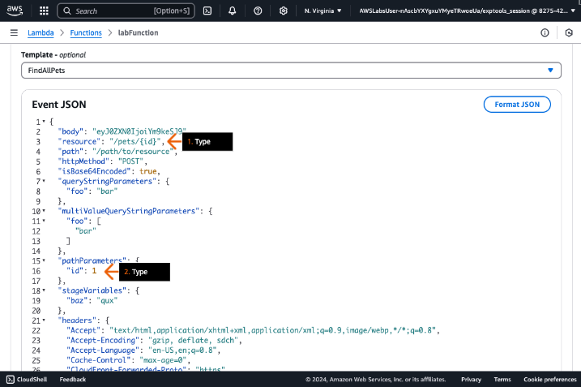
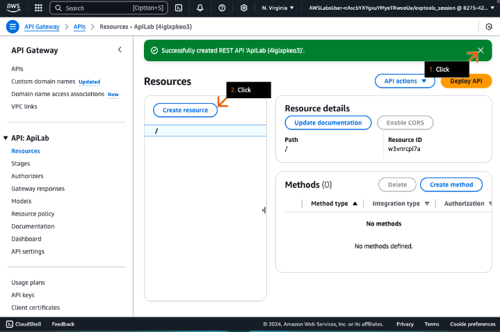

## Deploying RESTful APIs
### Use o Amazon API Gateway e uma função AWS Lambda para criar e implantar uma API.

- Objetivos do laboratório
    - Crie uma API REST do Amazon API Gateway.
    - Implante a API REST.
    - Invoque uma função AWS Lambda usando a integração de proxy do API Gateway.

    &nbsp;

    **Etapa 1**
    1. Revise os objetivos do laboratório prático na seção Conceito.
    2. Clique em Iniciar Laboratório ou Abrir Console AWS para começar.
    3. Siga as instruções do laboratório atentamente e use as setas abaixo para navegar entre as etapas.

    Os serviços da AWS não utilizados neste laboratório estão desabilitados no ambiente do laboratório. Além disso, os recursos dos serviços utilizados neste laboratório são limitados ao que o laboratório exige.

    **Conceito**

    Neste laboratório prático, você irá:
    - Criar uma API REST do Amazon API Gateway.
    - Implantar a API REST.
    - Invocar uma função AWS Lambda usando a integração de proxy do API Gateway.

    

    &nbsp;

    **Etapa 2**
    1. Na caixa de pesquisa da barra de navegação superior, digite: lambda
    2. Nos resultados da pesquisa, em Services, clique em Lambda.
    3. Vá para a próxima etapa.

    **Conceito**

    O AWS Lambda é um serviço de computação que ajuda você a executar código sem provisionar ou gerenciar servidores. O Lambda executa seu código somente quando necessário e pode escalar automaticamente de algumas requisições por dia para milhares por segundo. Você paga apenas pelo tempo de computação que utiliza, sem cobrança quando seu código não está em execução. Usando o AWS, você pode executar código para praticamente qualquer tipo de aplicação ou serviço de backend, tudo sem administração.

    

    &nbsp;

    **Etapa 3**
    1. No painel de navegação esquerdo, clique em Functions.
    2. Na seção Functions, clique em Create function.

        > Você pode ignorar com segurança quaisquer funções Lambda que já estejam exibidas na seção.

    3. Vá para a próxima etapa.

    **Conceito**

    Uma função Lambda consiste em código e quaisquer dependências associadas. Uma função Lambda também possui informações de configuração associadas a ela.

    

    &nbsp;

    **Etapa 4**
    1. Para Create function, escolha Author from scratch.
    2. Para Function name, digite: labFunction
    3. Para Runtime, escolha Python 3.x.

        > A versão do Python disponível no Console de Gerenciamento da AWS pode ser diferente da exibida no exemplo da captura de tela.

    4. Vá para a próxima etapa.

    **Conceito**

    Os runtimes do Lambda permitem que funções em diferentes linguagens sejam executadas no mesmo ambiente de execução base. Você configura sua função para usar um runtime que corresponda à sua linguagem de programação. O runtime fica entre o serviço Lambda e o código da sua função, retransmitindo eventos de invocação, informações de contexto e respostas entre os dois. Você pode usar runtimes fornecidos pelo Lambda ou construir os seus próprios.

    

    &nbsp;

    **Etapa 5**
    1. Em Permissions, clique para expandir Change default execution role.
    2. Para Execution role, escolha Use an existing role.
    3. Para Existing role, na lista suspensa, escolha lab_function_role.
    4. Clique em Create function.
    5. Vá para a próxima etapa.

    **Conceito**

    A função de execução de uma função Lambda é uma função do AWS Identity and Access Management (IAM) que concede permissão à função para acessar serviços e recursos da AWS. Você fornece essa função ao criar uma função, e o Lambda assume a função quando sua função é invocada.

    

    &nbsp;

    **Etapa 6**
    1. Nesta página, clique na aba Lab Files.
    2. Clique nos ícones de download para salvar os dois arquivos de laboratório no seu dispositivo.

        > Use o arquivo sample_code em uma etapa posterior e o arquivo vehicles_function na seção DIY desta solução.

    3. Clique na aba Steps para retornar às etapas do Practice Lab.
    4. Vá para a próxima etapa.

    **Conceito**

    Todos os arquivos necessários para este laboratório são fornecidos a você.

    

    &nbsp;

    **Etapa 7**
    1. Na página labFunction, role para baixo até a aba Code.
    2. Na janela de código lambda_function, selecione (realce) o código.
    3. Exclua o código.
    4. Vá para a próxima etapa.

    **Conceito**

    Usando o editor de código no console do Lambda, você pode escrever, testar e visualizar os resultados da execução do código da sua função Lambda. O código da função Lambda é armazenado no Amazon Simple Storage Service (Amazon S3) e é criptografado em repouso.

    

    &nbsp;

    **Etapa 8**
    1. Cole o código do arquivo sample_code.py que você baixou em uma etapa anterior.

        > Você pode abrir um arquivo .py com o IDLE (que vem com o Python), o Notepad++ ou outro editor de texto ou IDE.  
        > Os blocos de código Python são definidos por sua indentação, portanto, mantenha a indentação entre copiar e colar.

    2. Revise o código.
    3. Clique em Deploy.
    4. Vá para a próxima etapa.

    **Conceito**

    Quando você testa sua função Lambda, você quer injetar alguns eventos JSON (entrada), validando que a função se comporta como esperado e retorna a resposta correta (saída).

    

    &nbsp;

    **Etapa 9**
    1. No alerta de sucesso, revise a mensagem.
    2. Para criar um evento de teste, clique na aba Test.
    3. Vá para a próxima etapa.

    **Conceito**

    Você pode criar até dez eventos de teste por função. Os eventos de teste que você cria não estão disponíveis para outros usuários.

    

    &nbsp;

    **Etapa 10**
    1. Para Ação do evento de teste, escolha Create new event.
    2. Para Event name, digite: FindAllPets
    3. Para Event sharing settings, revise para confirmar se Private está selecionado.
    4. Para Template, escolha apigateway-aws-proxy.
    5. Para JSON do evento, na linha 3, digite: "resource": "/pets",

        > Certifique-se de digitar exatamente como mostrado.

    6. Na parte superior da seção Test event, clique em Save.
    7. Clique em Test.
    8. Vá para a próxima etapa.

    **Conceito**

    Você pode usar modelos de exemplo para testar uma integração de proxy do Amazon API Gateway. Você pode então personalizar seu teste para fazer coisas como simular uma chamada de recurso para todos os recursos no código.

    

    &nbsp;

    **Etapa 11**
    1. Clique para expandir Details.
    2. Revise a resposta.
    3. Role para baixo até Test event.
    4. Vá para a próxima etapa.

    **Conceito**

    Lambda executa sua função em seu nome. O manipulador da função recebe e então processa o evento de amostra.

    

    &nbsp;

    **Etapa 12**
    1. Para Test event action, escolha Create new event.
    2. Para Event name, digite: FindPetById
    3. Para Event sharing settings, revise para confirmar se a opção Private está selecionada.
    4. Para Template, escolha FindAllPets.
    5. Vá para a próxima etapa.

    **Conceito**

    Com base nos testes existentes, você pode criar outro evento de teste.

    

    &nbsp;

    **Etapa 13**
    1. Para o Event JSON, na linha 3, digite: "resource": "/pets/{id}",
    2. Na linha 16, digite: "id": 1

        > Certifique-se de digitar ambos exatamente como mostrado.

    3. Vá para a próxima etapa.

    **Conceito**

    É possível ver a saída com base em uma variedade de entradas diferentes, incluindo parâmetros de recurso, ao criar vários eventos de teste.

    

    &nbsp;

    **Etapa 14**
    1. Na parte superior da seção Test event, clique em Save.
    2. Clique em Test.
    3. Vá para a próxima etapa.

    **Conceito**

    Criar múltiplos eventos de teste é útil quando você deseja ajustar ligeiramente um de seus eventos existentes e ainda manter a versão anterior intacta. Quando você não tem certeza de como estruturar um evento específico a partir de uma fonte de evento, você pode usar um dos modelos de evento de amostra e ajustá-lo às suas necessidades.

    

    &nbsp;

    **Etapa 15**
    1. Em Details, revise a resposta.
    2. Vá para a próxima etapa.

    

    &nbsp;

    **Etapa 16**
    1. Na caixa de pesquisa da barra de navegação superior, digite: api
    2. Nos resultados da pesquisa, em Services, clique em Gateway de API.
    3. Vá para a próxima etapa.

    **Conceito**

    Você pode criar uma API web com um endpoint HTTP para sua função Lambda usando o Amazon API Gateway. O API Gateway fornece ferramentas para criar e documentar APIs web que roteiam solicitações HTTP para funções Lambda.

    

    &nbsp;

    **Etapa 17**
    1. Na página inicial do console do Amazon API Gateway, role para baixo até REST API.
    2. No cartão REST API, clique em Build.

        > Certifique-se de NÃO escolher a opção REST API Private.

    3. Vá para a próxima etapa.

    **Conceito**

    O API Gateway lida com todas as tarefas envolvidas na aceitação e processamento de centenas de milhares de chamadas de API simultâneas, incluindo gerenciamento de tráfego, autorização e controle de acesso, monitoramento e gerenciamento de versão de API.

    

    &nbsp;

    **Etapa 18**
    1. Selecione New API.
    2. Para API name, digite: ApiLab
    3. Para Description, digite: API to support lab
    4. Para API endpoint type, revise para confirmar se Regional está selecionado.
    5. Clique em Create API.
    6. Vá para a próxima etapa.

    **Conceito**

    O tipo de endpoint da API pode ser otimizado para borda (edge-optimized), Regional ou privado, dependendo de onde a maioria do tráfego da sua API se origina.

    

    &nbsp;

    **Etapa 19**
    1. No alerta de sucesso, revise a mensagem e clique no X para fechar o alerta.
    2. Clique em Create resource.
    3. Vá para a próxima etapa.

    **Conceito**

    Um recurso é uma entidade lógica que uma aplicação pode acessar através de um caminho de recurso.

    

    &nbsp;

    **Etapa 20**
    1. Em Resource name, digite: pets
    2. Clique em Create resource.
    3. Vá para a próxima etapa.

    **Conceito**

    Cada entidade de recurso pode ter um ou mais métodos. Um método define a API para o cliente acessar o recurso exposto e representa uma requisição de entrada submetida pelo cliente.

    

    &nbsp;

    **Etapa 21**
    1. No alerta de sucesso, revise a mensagem e clique no X para fechar o alerta.
    2. Para o recurso /pets, clique em Create method.
    3. Vá para a próxima etapa.

    **Conceito**

    Um método corresponde a uma requisição de API REST que é submetida pelo usuário da sua API e a resposta retornada ao usuário. Por exemplo, um navegador requisita dados de uma API REST e um arquivo JSON é retornado.

    

    &nbsp;

    **Etapa 22**
    1. Para o Method type, escolha GET.
    2. Para o Integration type, escolha a função Lambda.
    3. Ative a Lambda proxy integration.
    4. Vá para a próxima etapa.

    **Conceito**

    HTTP define um conjunto de métodos de requisição para indicar a ação desejada a ser realizada para um dado recurso.

    

    &nbsp;

    **Etapa 23**
    1. Para a Lambda function, revise para confirmar se a região AWS us-east-1 está selecionada.
    2. Na próxima caixa de pesquisa, digite: lab e escolha o ARN labFunction.

        > Você criou esta função Lambda em uma etapa anterior.

    3. Clique em Create method.
    4. Vá para a próxima etapa.

    **Conceito**

    Com a integração de proxy Lambda, a requisição completa do cliente é enviada para a função Lambda de backend, tal como está, exceto que a ordem dos parâmetros da requisição não é preservada. O API Gateway mapeia a requisição completa do cliente para o parâmetro de evento de entrada da função Lambda de backend. A saída da função Lambda, incluindo código de status, cabeçalhos e corpo, é retornada ao cliente tal como está.

    

    &nbsp;

    **Etapa 24**
    1. No alerta de sucesso, revise a mensagem e clique no X para fechar o alerta.
    2. Abaixo da janela /pets - GET - Method execution, clique na aba Test.
    3. Vá para a próxima etapa.

    **Conceito**

    Você pode testar a integração entre API Gateway e Lambda.

    

    &nbsp;

    **Etapa 25**
    1. Na seção Test method, clique em Test.
    2. Vá para a próxima etapa.

    **Conceito**

    A ação de teste simula uma requisição GET de um cliente.

    

    &nbsp;

    **Etapa 26**
    1. Em Status e Response body, revise os resultados.

        > O corpo da resposta pode ter um layout diferente do exemplo da captura de tela.

    2. Vá para a próxima etapa.

    **Conceito**

    O API Gateway retorna o cabeçalho, corpo e código de status da função Lambda.

    

    &nbsp;

    **Etapa 27**
    1. No painel Resources, clique em /pets.
    2. Clique em Create resource.
    3. Vá para a próxima etapa.

    **Conceito**

    Um recurso é um objeto tipado que faz parte do domínio da sua API. Cada recurso pode ter um modelo de dados associado, relacionamentos com outros recursos e pode responder a diferentes métodos.

    

    &nbsp;

    **Etapa 28**
    1. Em Resource name, digite: {id}
    2. Clique em Create resource.
    3. Vá para a próxima etapa.

    **Conceito**

    Você também pode definir recursos como variáveis para interceptar requisições a múltiplos recursos filhos.

    

    &nbsp;

    **Etapa 29**
    1. No alerta de sucesso, revise a mensagem e clique no X para fechar o alerta.
    2. No painel Resources, revise para confirmar se /{id} está selecionado.
    3. Clique em Create method.
    4. Vá para a próxima etapa.

    **Conceito**

    No API Gateway, um método de API incorpora uma requisição de método e uma resposta de método. Você configura um método de API para definir o que um cliente deve ou precisa fazer para enviar uma requisição para acessar o serviço no backend e para definir as respostas que o cliente recebe em troca.

    

    &nbsp;

    **Etapa 30**
    1. Para o Method type, escolha GET.
    2. Para o Integration type, escolha a função Lambda.
    3. Ative a Lambda proxy integration.
    4. Para a Lambda function, escolha labFunction.
    5. Role a página até o final e clique em Create method (não mostrado).
    6. Vá para a próxima etapa.

    **Conceito**

    Para configurar a requisição do método, você configura um método HTTP (ou verbo), o caminho para um recurso de API, cabeçalhos e parâmetros de string de consulta aplicáveis. Você também configura um payload quando o método HTTP é POST, PUT ou PATCH.

    

    &nbsp;

    **Etapa 31**
    1. No painel Resources, revise para confirmar se o método GET para o recurso /{id} está selecionado.
    2. Clique na aba Test.
    3. Vá para a próxima etapa.

    

    &nbsp;

    **Etapa 32**
    1. Na seção Test method, em Id, digite: 1
    2. Clique em Test.
    3. Vá para a próxima etapa.

    **Conceito**

    Um teste, por exemplo, pode simular uma requisição GET de um cliente e incluir um parâmetro.

    

    &nbsp;

    **Etapa 33**
    1. Em Response body, revise para confirmar o ID e o nome corretos.
    2. Vá para a próxima etapa.

    **Conceito**

    O runtime do Lambda serializa o objeto de resposta para JSON e o envia para a API. A API analisa a resposta e a utiliza para criar uma resposta HTTP, que então envia para o cliente que fez a requisição original.

    

    &nbsp;

    **Etapa 34**
    1. No topo da página, clique em Deploy API.
    2. Vá para a próxima etapa.

    **Conceito**

    Após criar sua API, você deve implantá-la para torná-la acessível aos seus usuários. Essa ação cria uma URL externa.

    

    &nbsp;

    **Etapa 35**
    1. Na caixa pop-up, para Stage, escolha *New stage*.
    2. Para Stage name, digite: lab
    3. Para Deployment description, digite uma breve descrição, como Lab deployment.
    4. Clique em Deploy.
    5. Vá para a próxima etapa.

    **Conceito**

    Um estágio representa um identificador único para uma versão de uma API REST implantada que pode ser invocada por usuários.

    

    &nbsp;

    **Etapa 36**
    1. No alerta de sucesso, revise a mensagem.
    2. Em Invoke URL, clique no ícone de cópia para copiar a URL fornecida.
    3. Vá para a próxima etapa.

    **Conceito**

    Um estágio é uma referência nomeada a uma implantação, que é um *snapshot* da API. Você usa um estágio para gerenciar e otimizar uma implantação específica.

    

    &nbsp;

    **Etapa 37**
    1. Na barra de endereço de uma nova aba (ou janela) do navegador, cole a URL de invocação que você acabou de copiar.
    2. Para invocar sua API, no final da URL colada, digite: /pets e pressione Enter.
    3. Vá para a próxima etapa.

    **Conceito**

    Você pode usar qualquer cliente HTTP (como um navegador, curl ou SDK) para testar sua API.

    

    &nbsp;

    **Etapa 38**
    1. Revise a resposta.
    2. Vá para a próxima etapa.

    **Conceito**

    Você pode testar uma chamada para retornar todos os recursos.

    

    &nbsp;

    **Etapa 39**
    1. Na barra de endereços de uma nova aba (ou janela) do navegador, cole a mesma URL de invocação.
    2. No final da URL colada, digite: /pets/3 e pressione Enter.
    3. Revise a resposta.
    4. Vá para a próxima etapa.

    **Conceito**

    Você pode testar diferentes valores de parâmetros alterando a URL.

    

- DIY
    - Use o arquivo de exemplo vehicles_function.py para criar uma nova função Lambda.
    - Crie um novo endpoint do API Gateway para veículos e integre-o com a nova função Lambda.
    > Nosso serviço de teste fará duas chamadas separadas para a URL de invocação do API Gateway. A primeira chamada será uma solicitação GET para a URL /vehicles para recuperar todos os veículos. A segunda chamada será uma solicitação GET para /vehicles/{id} para recuperar os detalhes de um único veículo.  

    > Chame uma: GET /vehicles
    ```json
    {
    [ { id: 1, ... }, { id:2, ...} ]
    }
    ```

    > Chame dois: GET /vehicles/1
    ```json
    {"id": "1", "type": "bike", "available": "true"}
    ```
    > Digite a URL do seu API Gateway na tela de validação do teste para confirmar. Inclua /vehicles no final da URL.

## Saiba mais


