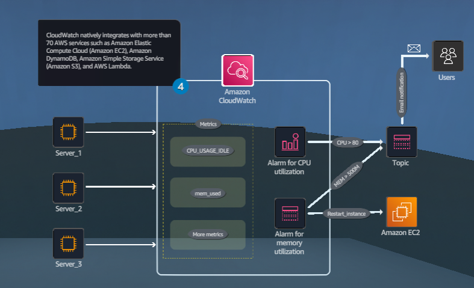

## Resource Monitoring
### Crie um painel de monitoramento central que notifique os engenheiros imediatamente e automaticamente sobre uma falha do sistema.

- Objetivos do laboratório
    - Investigar o monitoramento padrão de instâncias do Amazon EC2.
    - Criar um painel do Amazon CloudWatch e adicionar um widget.
    - Criar um alarme do CloudWatch para utilização da CPU.
    - Criar uma ação do CloudWatch para enviar uma notificação por e-mail usando o Amazon SNS.

    &nbsp;

    **Etapa 1**
    1. Revise os objetivos do laboratório prático na seção Conceito.
    2. Clique em Iniciar Laboratório ou Abrir Console AWS para começar.
    3. Siga as instruções do laboratório atentamente e use as setas abaixo para navegar entre as etapas.

    Os serviços da AWS não utilizados neste laboratório estão desabilitados no ambiente do laboratório. Além disso, os recursos dos serviços utilizados neste laboratório são limitados ao que o laboratório exige.

    **Conceito**

    Neste laboratório prático, você irá:
    - Investigar o monitoramento padrão de instâncias do Amazon EC2.
    - Criar um painel do Amazon CloudWatch e adicionar um widget.
    - Criar um alarme do CloudWatch para utilização da CPU.
    - Criar uma ação do CloudWatch para enviar uma notificação por e-mail usando o Amazon SNS.

    

    &nbsp;

    **Etapa 2**
    1. Na caixa de pesquisa da barra de navegação superior, digite: ec2
    2. Nos resultados da pesquisa, em Serviços, clique em EC2.
    3. Vá para a próxima etapa.

    **Conceito**

    A AWS fornece ferramentas automatizadas e manuais que você pode usar para monitorar seus sistemas.

    

    &nbsp;

    **Etapa 3**
    1. No painel de navegação esquerdo, clique em Instances.
    2. Na seção Instances, em Status check, revise para garantir que as três instâncias apresentem 3/3 verificações aprovadas.

        > Aguarde a alteração dos status antes de prosseguir.

    3. Vá para a próxima etapa.

    **Conceito**

    As verificações de status do sistema monitoram os sistemas AWS nos quais sua instância é executada. Essas verificações detectam problemas subjacentes com sua instância que podem exigir o envolvimento da AWS para reparo.

    

    &nbsp;

    **Etapa 4**
    1. Em Name, marque a caixa de seleção para selecionar Server_1.
    2. Para essa instância, clique na aba Monitoring.
    3. Revise todas as métricas, incluindo a utilização da CPU.

        > Pode ser necessário clicar no ícone de atualização na seção Instances.

    4. Vá para a próxima etapa.

    **Conceito**

    Você pode usar o Console de Gerenciamento da AWS, a AWS CLI ou uma API para listar as métricas que o Amazon Elastic Compute Cloud (Amazon EC2) envia para o Amazon CloudWatch.

    

    &nbsp;

    **Etapa 5**
    1. Em Nome, desmarque a caixa de seleção para desmarcar Server_1.
    2. Repita o procedimento anterior selecionando e revisando as métricas para Server_2 e Server_3.
    3. Vá para a próxima etapa.

    **Conceito**

    Por padrão, o monitoramento básico está habilitado para que os dados fiquem disponíveis em períodos de 5 minutos. Opcionalmente, você pode habilitar o monitoramento detalhado para que os dados fiquem disponíveis em períodos de 1 minuto.

    

    &nbsp;

    **Etapa 6**
    1. Na caixa de pesquisa da barra de navegação superior, digite: cloudwatch
    2. Nos resultados da pesquisa, em Serviços, clique em CloudWatch.
    3. Vá para a próxima etapa.

    **Conceito**

    O Amazon CloudWatch é basicamente um repositório de métricas. Um serviço da AWS, como o Amazon EC2, insere métricas no repositório, e você recupera estatísticas com base nessas métricas.

    

    &nbsp;

    **Etapa 7**
    1. No painel de navegação esquerdo, clique em All metrics.
    2. Na guia Browse, em Namespaces personalizados, clique em PowerPlantMetrics.
    3. Vá para a próxima etapa.

    **Conceito**

    Um namespace é um contêiner para métricas do CloudWatch. Métricas em diferentes namespaces são isoladas umas das outras, para que métricas de diferentes aplicações não sejam agregadas erroneamente nas mesmas estatísticas.

    

    &nbsp;

    **Etapa 8**
    1. Na caixa de pesquisa do PowerPlantMetrics, digite: cpu e pressione Enter.
    2. Vá para a próxima etapa.

    **Conceito**

    Você pode adicionar um filtro de busca para localizar tipos de métricas específicos.

    

    &nbsp;

    **Etapa 9**
    1. Clique no agrupamento de métricas, PowerPlantMetrics > InstanceId, InstanceType.
    2. Vá para a próxima etapa.

    **Conceito**

    Métricas são o conceito fundamental no CloudWatch.

    

    &nbsp;

    **Etapa 10**
    1. Na caixa de pesquisa, digite: CPU_USAGE_IDLE e pressione Enter.

        > CPU_USAGE_IDLE é a porcentagem de tempo em que a CPU fica ociosa.

    2. Marque as caixas de seleção para selecionar os três servidores (Server_1, Server_2 e Server_3).
    3. Revise o gráfico exibido.
    4. Vá para a próxima etapa.

    **Conceito**

    Uma métrica representa um conjunto de pontos de dados ordenados por tempo que são publicados no CloudWatch.

    

    &nbsp;

    **Etapa 11**
    1. Acima do gráfico, clique em Actions para expandir o menu suspenso.
    2. Selecione Add to dashboard - Improved.
    3. Vá para a próxima etapa.

    **Conceito**

    Você pode visualizar seus dados em diferentes níveis, como uma visualização de 1 minuto, que pode ser útil ao solucionar problemas, ou escolher uma visualização menos detalhada, de 1 hora.

    

    &nbsp;

    **Etapa 12**
    1. Na caixa pop-up, em Select a dashboard, clique em Create new.
    2. Vá para a próxima etapa.

    **Conceito**

    Os painéis do CloudWatch são páginas iniciais personalizáveis no console do CloudWatch que você pode usar para monitorar seus recursos em uma única visualização, mesmo recursos espalhados por diferentes Regiões.

    

    &nbsp;

    **Etapa 13**
    1. Para Create new dashboard, digite: Power-Plant-Dashboard
    2. Para criar o novo painel, clique em Create.
    3. Vá para a próxima etapa.

    

    &nbsp;

    **Etapa 14**
    1. Em Widget type, no menu suspenso, selecione Bar.
    2. Em Customize widget title, digite: Servers Idle CPU Usage
    3. Clique em Add to dashboard.
    4. Vá para a próxima etapa.

    

    &nbsp;

    **Etapa 15**
    1. No widget exibido, arraste o canto inferior direito para alterar o tamanho da tela.
    2. Revise o gráfico.

        > Observe o servidor com maior uso de CPU.  
        > O servidor com maior uso de CPU tem o menor uso de CPU ocioso.

    3. Para salvar o widget, clique em Save.
    4. Vá para a próxima etapa.

    **Conceito**

    Todos os painéis são globais, não específicos da Região.

    

    &nbsp;

    **Etapa 16**
    1. No painel de navegação esquerdo, clique em All alarms.

        > Pode ser necessário clicar no ícone de menu (três linhas) no painel lateral esquerdo para expandir o painel de navegação.

    2. Na seção Alarms, clique em Create alarm.
    3. Vá para a próxima etapa.

    

    &nbsp;

    **Etapa 17**
    1. Na etapa Specify metric and conditions, clique em Select metric.
    2. Vá para a próxima etapa.

    

    &nbsp;

    **Etapa 18**
    1. Na guia Browse, na caixa de pesquisa Metrics, digite: CPU_USAGE_IDLE e pressione Enter.
    2. Clique no agrupamento de métricas, PowerPlantMetrics > InstanceId, InstanceType.

        > Se necessário, role para baixo para ver os nomes das métricas.

    3. Vá para a próxima etapa.

    

    &nbsp;

    **Etapa 19**
    1. Em Instance name, marque a caixa de seleção para selecionar Server_1.

        > Este é o servidor que você observou anteriormente com o maior uso de CPU.

    2. Clique em Select metric.
    3. Vá para a próxima etapa.

    **Conceito**

    Um alarme de métrica observa uma única métrica do CloudWatch ou o resultado de uma expressão matemática baseada em métricas do CloudWatch. Você precisa criar um alarme para cada sistema.

    

    &nbsp;

    **Etapa 20**
    1. Role para baixo até Conditions.
    2. Vá para a próxima etapa.

    

    &nbsp;

    **Etapa 21**
    1. Para Threshold type, escolha Static.
    2. Para Define the alarm condition, escolha Lower/Equal.
    3. Para Define the threshold value, digite: 20

        > O alarme é definido quando o uso ocioso da CPU é de 20% ou menos. Isso indica que o uso da CPU é de 80% ou mais.

    4. Clique em Next.
    5. Vá para a próxima etapa.

    **Conceito**

    Alarmes do CloudWatch executam uma ou mais ações com base em limites específicos que você define no alarme.

    

    &nbsp;

    **Etapa 22**
    1. Na etapa Configure actions, para Alarm state trigger, escolha In alarm.
    2. Para Send a notification to the following SNS topic, escolha Create new topic.
    3. Para Create new topic, digite: High_CPU_USAGE
    4. Para Email endpoints that will receive notification, digite um endereço de e-mail ao qual você tenha acesso.

        > Você precisará acessar este e-mail para confirmar sua inscrição para receber a notificação do SNS.

    5. Vá para a próxima etapa.

    **Conceito**

    O Amazon Simple Notification Service (Amazon SNS) é um serviço gerenciado que fornece entrega de mensagens de publicadores para assinantes (também conhecidos como produtores e consumidores).

    

    &nbsp;

    **Etapa 23**
    1. Clique em Create topic.

        > Você receberá uma confirmação de inscrição da AWS Notification em seu e-mail.

    2. No e-mail recebido, clique no link Confirm subscription.
    3. De volta à página do console, role a página até o final e clique em Next (não exibido).
    4. Vá para a próxima etapa.

    **Conceito**

    Publicadores se comunicam assincronamente com assinantes enviando mensagens para um tópico, que é um ponto de acesso lógico e um canal de comunicação.

    

    &nbsp;

    **Etapa 24**
    1. Na etapa Add name and description, em Alarm name, digite: High-CPU-Usage
    2. Em Alarm description, digite uma descrição de sua preferência.
    3. Clique em Next.
    4. Vá para a próxima etapa.

    

    &nbsp;

    **Etapa 25**
    1. Na etapa Preview and create, revise as seções Metric ​​e Conditions.

        > Pode ser necessário rolar a tela para baixo para visualizar a seção Conditions.

    2. Role a tela para baixo até o final da página e clique em Create alarm (não exibido).
    3. Vá para a próxima etapa.

    **Conceito**

    Um alarme invoca ações somente quando o estado do alarme muda.

    

    &nbsp;

    **Etapa 26**
    1. Na seção Alarms, em State, verifique se o estado do alarme muda de Insufficient data para In alarm.
    2. Verifique seu e-mail.

        > Você deverá receber um e-mail da AWS Notifications sobre este alerta de alarme.

    3. Vá para a próxima etapa.

    **Conceito**

    Um estado de INSUFFICIENT\_DATA significa que um alarme acabou de iniciar, a métrica não está disponível ou não há dados suficientes disponíveis para a métrica determinar o estado do alarme.

    

- DIY
    - Adicionar um painel do CloudWatch para utilização da memória (mem_used).
    - Criar um alarme do CloudWatch para utilização da memória (mem_used) acima de 300M (300.000.000).
    - Adicionar uma ação do Amazon EC2 para reiniciar o servidor se o alarme for invocado.

## Saiba mais

