## Serverless Foundations
### Use o AWS Lambda para executar código sem provisionar um servidor.

- Objetivos do laboratório
    - Use Python para criar uma função AWS Lambda.
    - Implante a função Lambda.
    - Teste a função Lambda.

    &nbsp;

    **Etapa 1**
    1. Revise os objetivos do laboratório prático na seção Conceito.
    2. Clique em Iniciar Laboratório ou Abrir Console AWS para começar.
    3. Siga as instruções do laboratório atentamente e use as setas abaixo para navegar entre as etapas.

    Os serviços da AWS não utilizados neste laboratório estão desabilitados no ambiente do laboratório. Além disso, os recursos dos serviços utilizados neste laboratório são limitados ao que o laboratório exige.

    **Conceito**

    Neste laboratório prático, você irá:
    - Usar Python para criar uma função AWS Lambda.
    - Implantar a função Lambda.
    - Testar a função Lambda.

    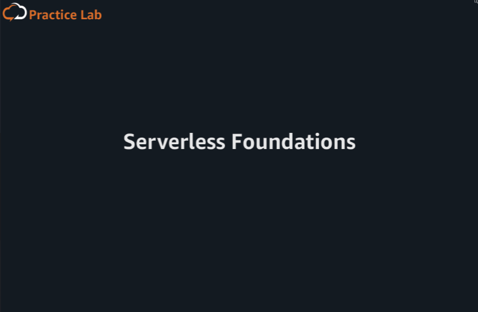

    &nbsp;

    **Etapa 2**
    1. Na barra de navegação superior, revise o seletor de região para garantir que a região esteja definida como N. Virginia (us-east-1).
    2. Na caixa de pesquisa de Serviços, digite: lambda
    3. Nos resultados da pesquisa, em Serviços, clique em Lambda.
    4. Vá para a próxima etapa.

    **Conceito**

    O AWS Lambda executa seu código somente quando necessário e pode escalar automaticamente de algumas requisições por dia para milhares por segundo. Usando o Lambda, você pode executar código para praticamente qualquer tipo de aplicação ou serviço de backend, tudo sem administração.

    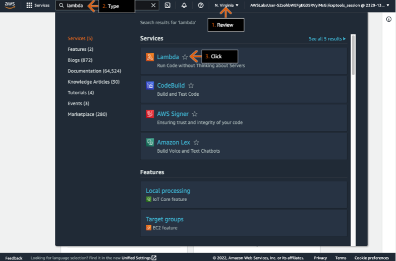

    &nbsp;

    **Etapa 3**
    1. Na seção Funções, clique em Create function.

        > Você pode ignorar com segurança quaisquer funções Lambda que já estejam exibidas na seção.

    2. Vá para a próxima etapa.

    **Conceito**

    Uma função Lambda consiste em código e quaisquer dependências associadas. Uma função Lambda também possui informações de configuração associadas a ela.

    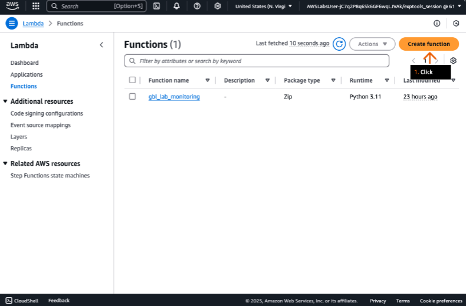

    &nbsp;

    **Etapa 4**
    1. Para Create function, escolha Author from scratch.
    2. Para Function name, digite: LabFunction

        > Você pode dar à função Lambda o nome que desejar.

    3. Para Runtime, no menu suspenso, escolha Python 3.11.

        > A versão do Python disponível no Console de Gerenciamento da AWS pode ser diferente da exibida no exemplo da captura de tela.

    4. Role a página até o final.
    5. Vá para a próxima etapa.

    **Conceito**

    Os runtimes do Lambda permitem que funções em diferentes linguagens sejam executadas no mesmo ambiente de execução base. Você configura sua função para usar um runtime que corresponda à sua linguagem de programação.

    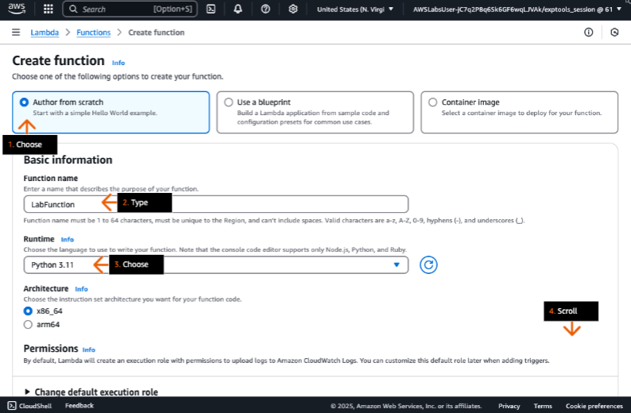

    &nbsp;

    **Etapa 5**
    1. Clique para expandir Change default execution role.
    2. Para Execution role, escolha Use an existing role.
    3. Para Existing role, escolha lab_function_role.
    4. Clique em Create function.
    5. Vá para a próxima etapa.

    **Conceito**

    A função de execução de uma função Lambda é uma função do AWS Identity and Access Management (IAM) que concede permissão à função para acessar serviços e recursos da AWS. Você fornece essa função ao criar uma função, e o Lambda assume a função quando sua função é invocada.

    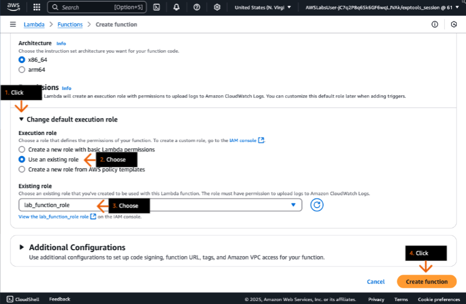

    &nbsp;

    **Etapa 6**
    1. Nesta página, clique na aba Arquivos de Laboratório.
    2. Clique no ícone de download para salvar o arquivo de laboratório no seu dispositivo.

        > Você usará este arquivo em uma etapa posterior.

    3. Clique na aba Etapas para retornar às etapas do Laboratório Prático.
    4. Vá para a próxima etapa.

    **Conceito**

    Todo o código necessário para este laboratório é fornecido a você.

    Todos os runtimes compartilham um modelo de programação comum que define a interface entre o seu código e o código do runtime.

    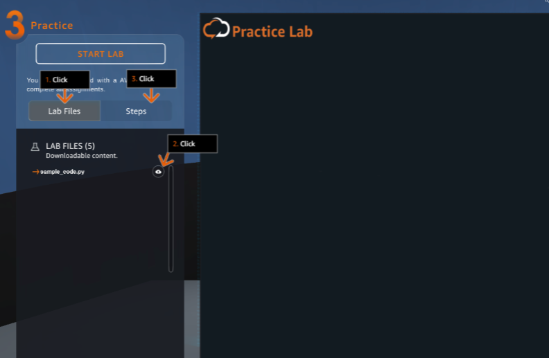

    &nbsp;

    **Etapa 7**
    1. Na página labFunction do console do AWS Lambda, role para baixo até a aba Code.
    2. Vá para a próxima etapa.

    **Conceito**

    Usando o editor de código no console do Lambda, você pode escrever, testar e visualizar os resultados da execução do código da sua função Lambda.

    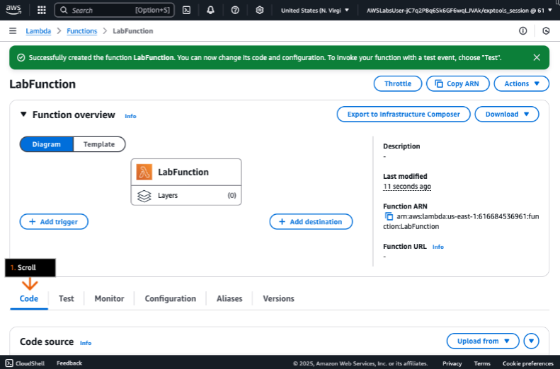

    &nbsp;

    **Etapa 8**
    1. Na janela de código da função lambda, selecione (destaque) o código.
    2. Exclua o código.
    3. Vá para a próxima etapa.

    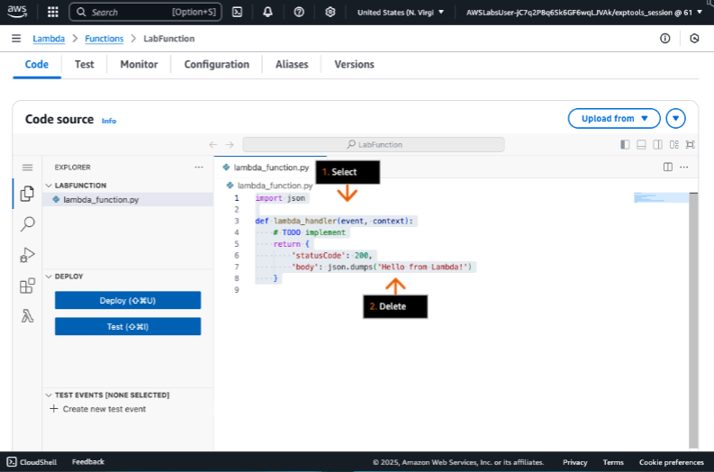

    &nbsp;

    **Etapa 9**
    1. Cole o código do arquivo sample_code.py que você baixou em uma etapa anterior.

        > Você pode abrir um arquivo .py com o IDLE (que vem com o Python), o Notepad++ ou outro editor de texto ou IDE.  
        > Os blocos de código Python são definidos por sua indentação, portanto, mantenha a indentação entre copiar e colar.

    2. Clique em Deploy.
    3. Vá para a próxima etapa.

    **Conceito**

    Você informa ao runtime qual método executar definindo um *handler* na configuração da função, e o runtime executa esse método. O runtime passa objetos para o *handler* que contêm o evento de invocação e o contexto, como o nome da função e o ID da requisição.

    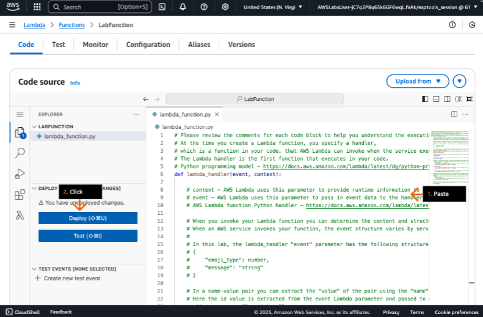

    &nbsp;

    **Etapa 10**
    1. Revise o conteúdo do código da função Lambda.

        > Revisar e compreender as diferentes partes do código da função Lambda é importante para as próximas etapas do laboratório.

    2. Revise os parâmetros usados ​​nesta função Lambda.

        > Revisar os parâmetros ajuda você na seção "DIY" desta solução.

    3. Vá para a próxima etapa.

    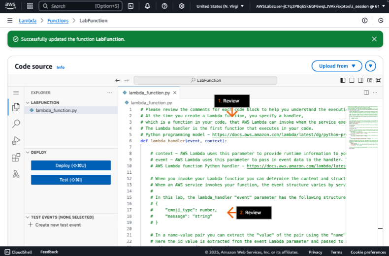

    &nbsp;

    **Etapa 11**
    1. Revise as instruções print e os valores utilizados.
    2. Revise as condições if-else na função Lambda.

        > Você deve atualizar esses itens na seção "DIY" posterior.

    3. Vá para a próxima etapa.

    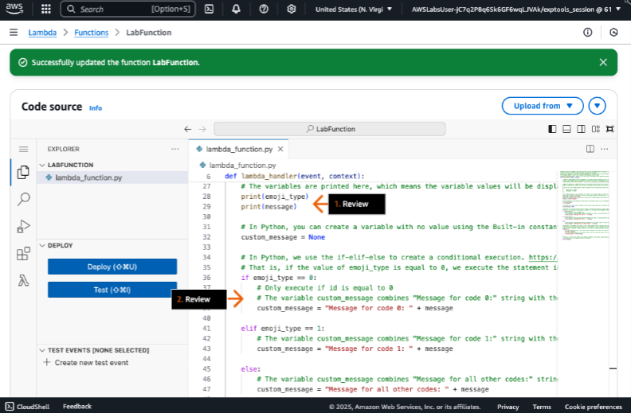

    &nbsp;

    **Etapa 12**
    1. Revise o conteúdo da seção de resposta.
    2. Revise a instrução return.

        > Quando a função labFunction é invocada, a resposta é retornada pela instrução return.

    3. Vá para a próxima etapa.

    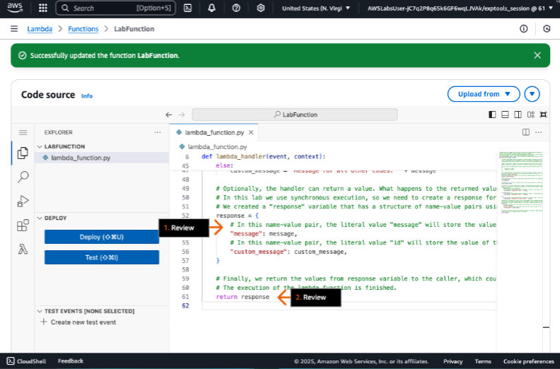

    &nbsp;

    **Etapa 13**
    > Para testar a função Lambda, você deve configurar os dados do evento de teste para sua função.

    1. Clique em Test.
    2. Vá para a próxima etapa.

    **Conceito**

    No console do Lambda, você pode testar sua função localmente. Você pode configurar até dez eventos de teste por função. Os eventos de teste que você configura não estão disponíveis para outros usuários.

    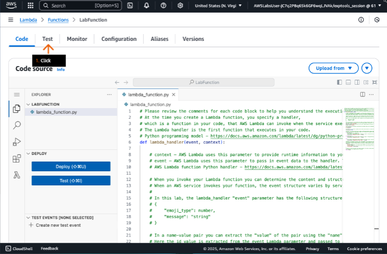

    &nbsp;

    **Etapa 14**
    1. Na caixa pop-up, para Event name, digite: MyTestEvent
    2. Para Event sharing settings, escolha Private.
    3. Para Template, escolha Mobile Backend.

        > O nome do modelo é exibido como mobile-backend-echo.

    4. Para JSON do evento, digite:
        ```json
        {
            "emoji_type" : 1,
            "message": "Olá, mundo!"
        }
        ```
        > Você também pode copiar e colar este texto. Você pode receber um valor indefinido na primeira tentativa. O código deve ser semelhante ao exibido no exemplo da captura de tela.

    5. Clique em Save.
    6. Vá para a próxima etapa.

    **Conceito**

    Você pode escolher modelos com exemplos de eventos que vêm de outros serviços AWS. Você também pode alterar chaves e valores no exemplo JSON para testar seu código.

    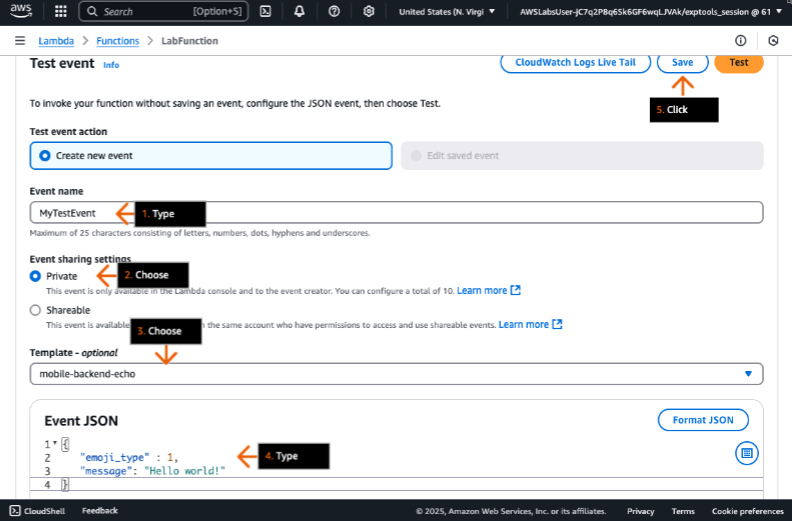

    &nbsp;

    **Etapa 15**
    1. Clique em Test.
    2. Na Execution results window, revise os resultados.

        > O status da execução deve ser exibido como Bem-sucedido e os resultados devem incluir a resposta da função e os logs da função.

    3. Role a página para cima até o topo.
    4. Vá para a próxima etapa.

    **Conceito**

    O Lambda executa sua função em seu nome. O *handler* em sua função Lambda recebe e então processa o evento de teste.

    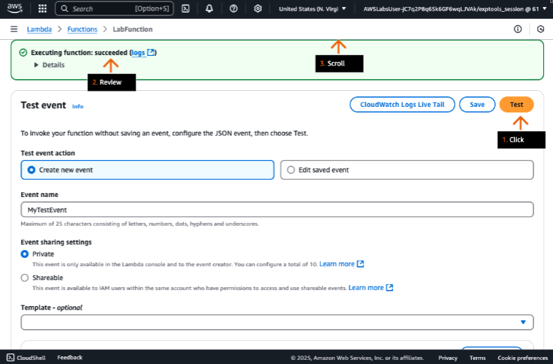

    &nbsp;

    **Etapa 16**
    1. Para revisar os logs de funções no Amazon CloudWatch, clique na aba Monitor.
    2. Vá para a próxima etapa.

    **Conceito**

    O Lambda monitora automaticamente as funções em seu nome, reportando métricas através do Amazon CloudWatch. As métricas incluem o número de requisições, a duração da invocação por requisição e o número de requisições que resultam em erro.

    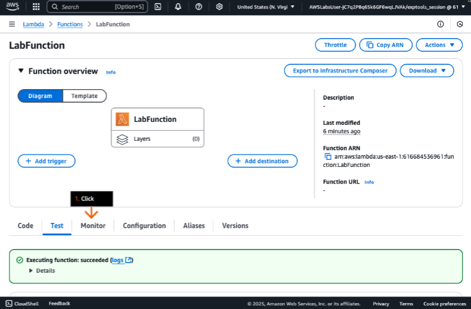

    &nbsp;

    **Etapa 17**
    1. Clique em View CloudWatch logs.

        > O console do Amazon CloudWatch será aberto em uma nova aba (ou janela) do navegador.

    2. Vá para a próxima etapa.

    **Conceito**

    Para ajudar na solução de problemas de falhas em uma função, o Lambda registra todas as requisições manipuladas por sua função e também armazena automaticamente os logs gerados pelo seu código, por meio do Amazon CloudWatch Logs.

    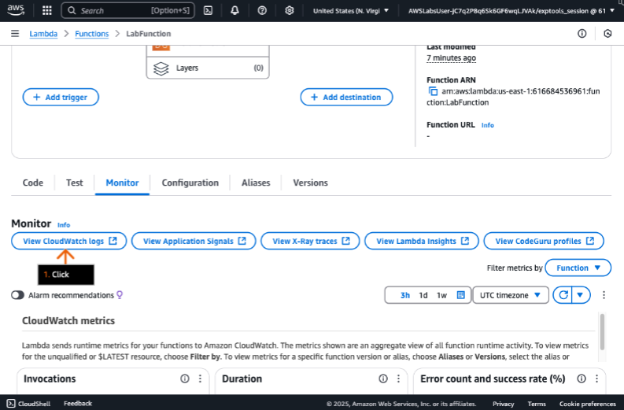

    &nbsp;

    **Etapa 18**
    1. Na aba Log streams, clique no primeiro fluxo de log.
    2. Vá para a próxima etapa.

    **Conceito**

    Um fluxo de log é uma sequência de eventos de log que compartilham a mesma origem. Sua função Lambda vem com um grupo de logs no Amazon CloudWatch Logs. Os logs incluem um fluxo de log para cada instância da sua função.

    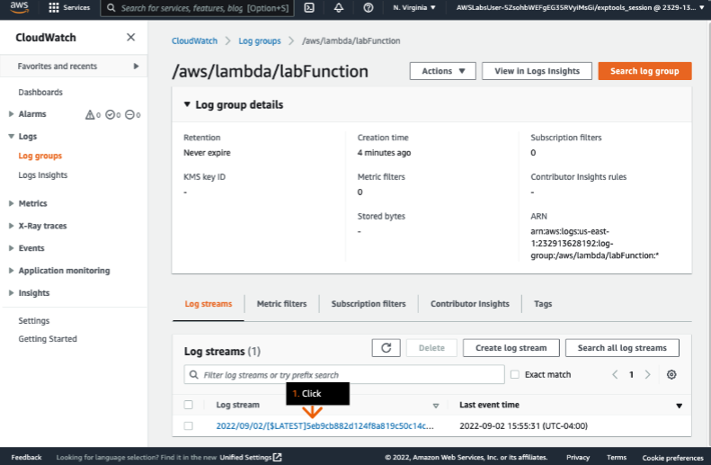

    &nbsp;

    **Etapa 19**
    1. Revise os logs do labFunction.
    2. Vá para a próxima etapa.

    **Conceito**

    O runtime do Lambda envia detalhes sobre cada invocação para o fluxo de log. O runtime então retransmite logs e outras saídas do código da sua função.

    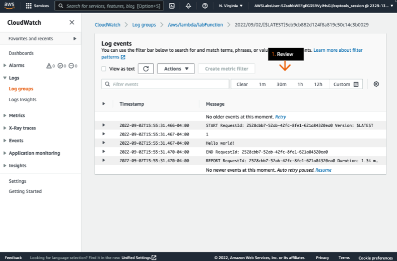

    &nbsp;

    **Etapa 20**
    1. Retorne ao console do AWS Lambda na aba anterior do navegador e clique na aba Test.
    2. Role para baixo até Event JSON.
    3. Vá para a próxima etapa.

    **Conceito**

    Você pode criar eventos de teste JSON para sua função na aba Test.

    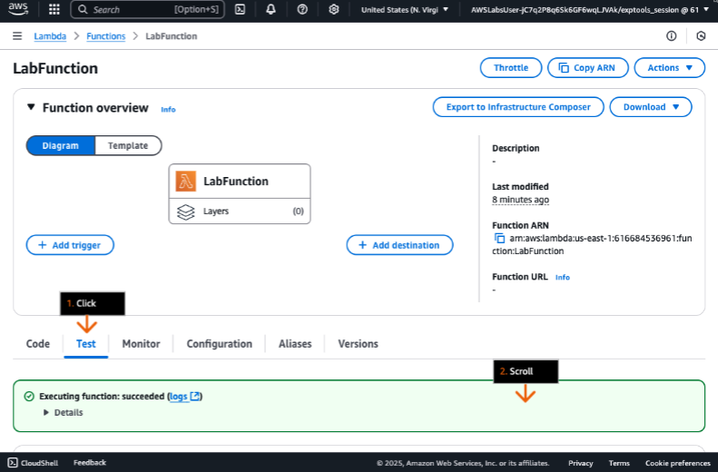

    &nbsp;

    **Etapa 21**
    1. Para a ação do evento de teste, selecione Edit saved event.
    2. Para JSON do evento, altere o valor emoji_type para 3.
    3. Na parte superior da seção Test event, clique em Salvar.
    4. Vá para a próxima etapa.

    **Conceito**

    Eventos de teste salvos também estão disponíveis na aba Code, no menu suspenso Test. Depois de criar um ou mais eventos de teste, você pode invocar sua função usando um dos seus testes como um evento.

    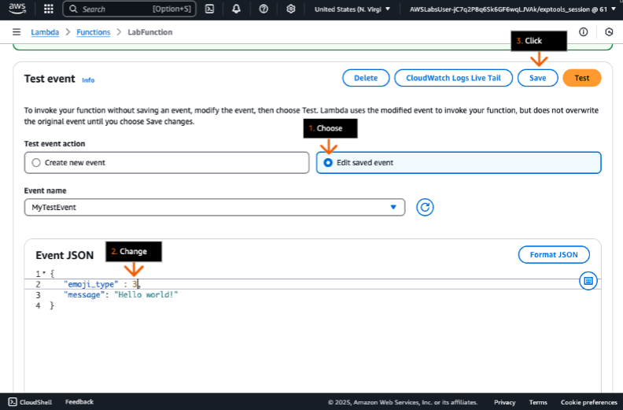

    &nbsp;

    **Etapa 22**
    1. No alerta de sucesso, revise a mensagem.
    2. Vá para a próxima etapa.

    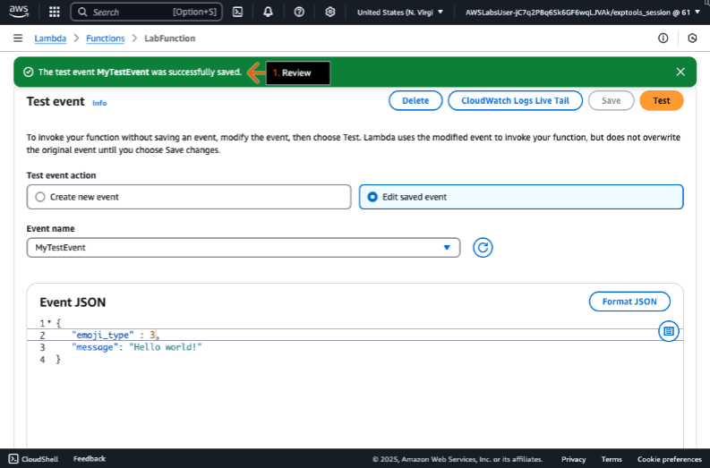

    &nbsp;

    **Etapa 23**
    1. Clique em Test.
    2. Vá para a próxima etapa.

    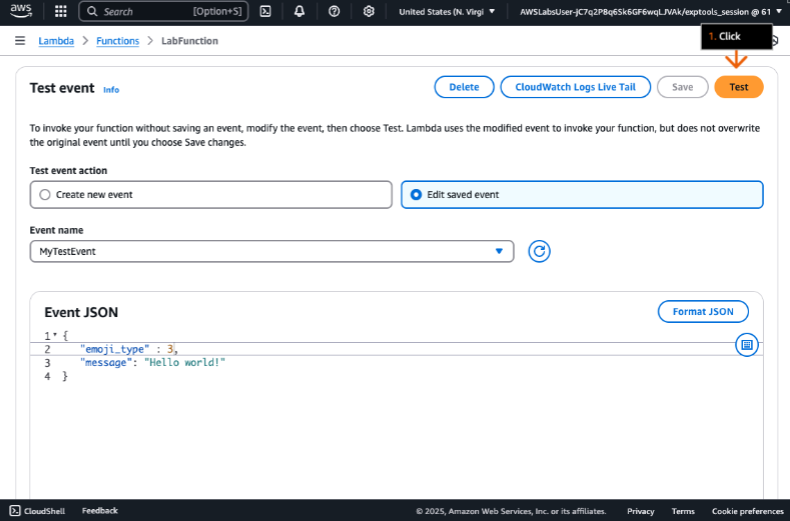

    &nbsp;

    **Etapa 24**
    1. Na seção Execution result: bem-sucedido, clique para expandir Details.
    2. Revise os resultados da resposta.

        > Para o valor 3 de emoji_type, custom_message exibe uma mensagem diferente.  
        > Você pode revisar o bloco if-else do código labFunction para ver todas as condições.

    3. Vá para a próxima etapa.

    **Conceito**

    O painel de resultados da execução exibe detalhes sobre o teste.

    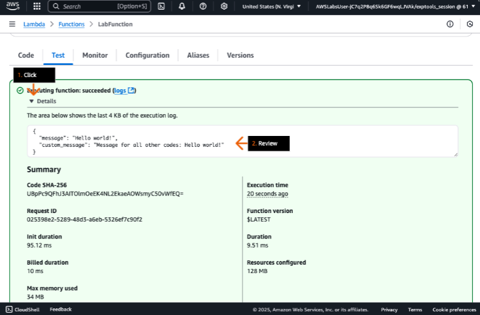

- DIY
    - Modifique o código da função Lambda para exibir diferentes valores de sentimento com base no valor de emoji_type no elemento JSON.

    >Nossos servidores de teste transmitirão um objeto JSON, contendo o elemento de identificação emoji_type e uma mensagem aleatória, para sua função Lambda. Exemplo:  
    ```json
    {  
        "emoji_type": 0,  
        "message": "Eu amo o parque"  
    }  
    ```
    >Atualize a função Lambda usando as seguintes regras:  
    &nbsp;  
    emoji_type = 0, retorna sentimento: "positivo"  
    emoji_type = 1, retorna sentimento: "neutro"  
    emoji_type = qualquer valor diferente de 0 e 1, retorna sentimento: "negativo"  
    &nbsp;  
    Após as atualizações anteriores, sua função Lambda deve retornar o sentimento interpretado no seguinte formato JSON (como já faz):  
    ```json  
    {  
        "feeling": "positivo",  
        "message": "Eu amo o parque"  
    }  
    ```
    >O código de validação procurará uma saída semelhante à exibida acima. Quaisquer caracteres extras na saída falharão na validação.

    > Dicas:
    Com base no código de exemplo fornecido (o arquivo sample_code.py que você baixou na seção Prática):
    > - Atualize o bloco if-else para adicionar uma variável para o atributo feeling (positivo, neutro, negativo).
    > - O atributo feeling (positivo, neutro, negativo) diferencia maiúsculas de minúsculas.
    > - Altere a seção de resposta do código para adicionar o atributo feeling em vez de custom_message.
    > - Você deve clicar em Implementar para salvar as alterações no código.

## Saiba mais
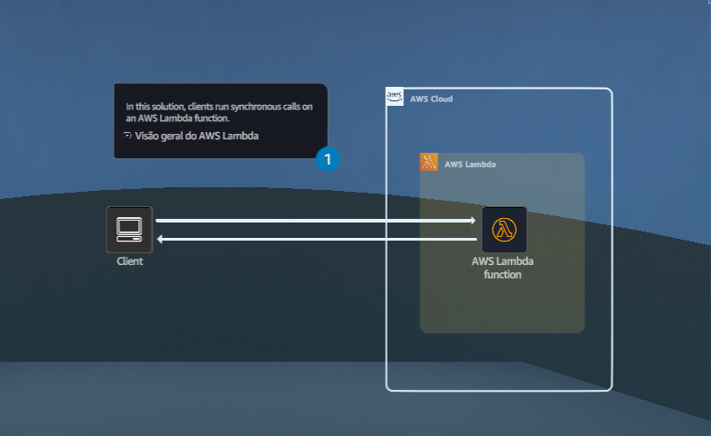
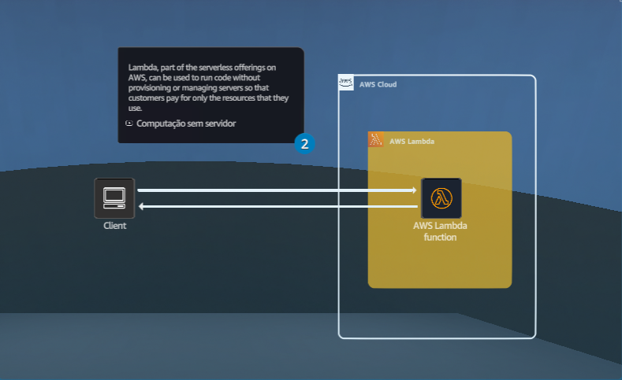
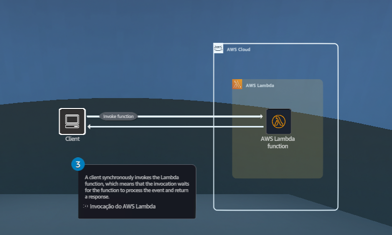
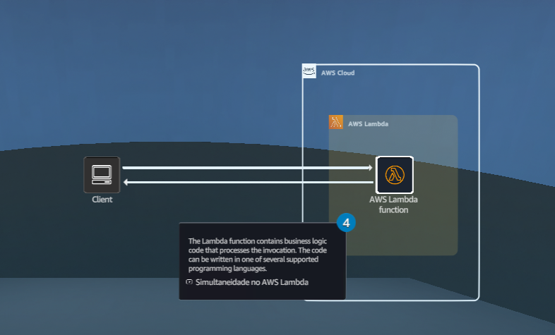
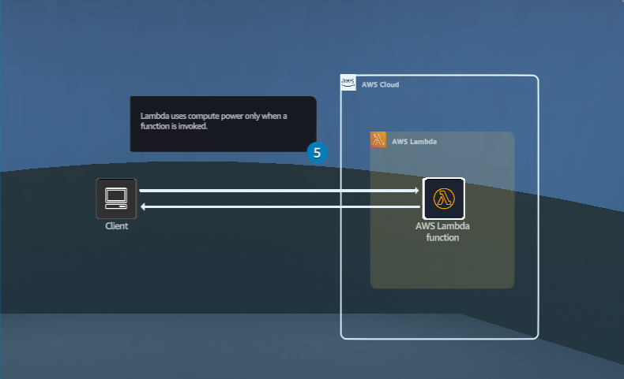
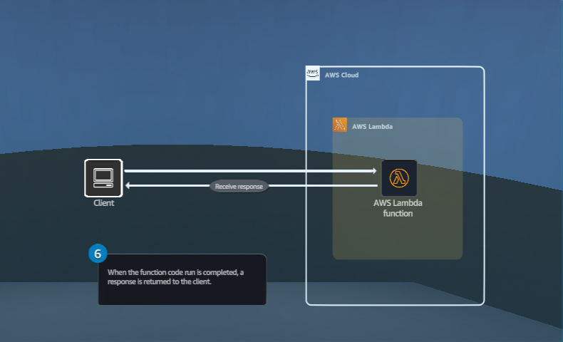
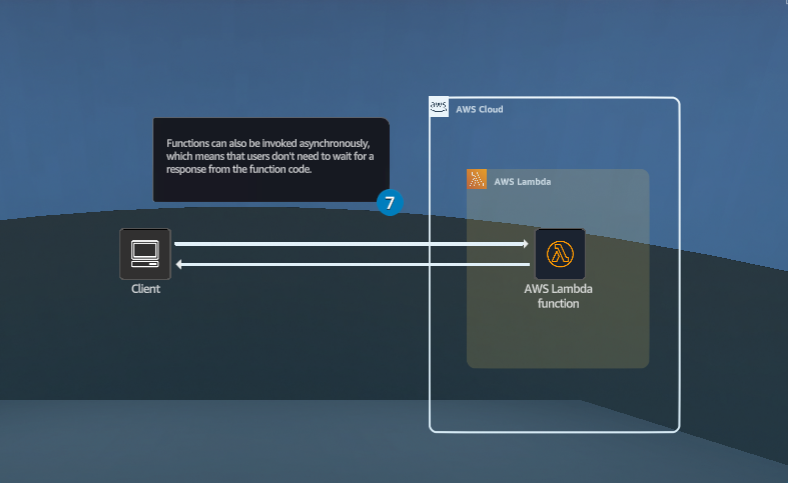